# Prodio

Product Requirements Document

Learning Tech & AI for Non-Technical Professionals

Prodio: an AI-judgment check platform, built and shipped as a working product, not a proposal.

Prepared by Rahul Raghunathan

A personal, self-directed product exploration, built end to end · live demo at prodio-ten.vercel.app 

## Contents

1. The Problem

2. Stakeholder Mapping

3. The Learning Journey: How It Works Today

4. Secondary Research

5. Existing Tools and the Seam They Miss

6. Primary Research, Right-Sized for the Problem

7. Opportunity and Prioritisation

8. Product Strategy: User, Buyer, Problem Statement

9. Solution Ideation and Direction

10. Product Detailing and MVP Scope

11. UX and Product Design

12. Analytics and Event Tracking

13. Build and Deployment

14. Launch, Growth Loop and Iteration

Appendix A: Ship-Ready Pressure-Test

Appendix B: How This PRD Came Together

---

## 1. The Problem

Technology and AI are now part of everyday work, and for the first time you do not need to be a developer to use them. A marketer, an HR lead, a finance analyst, or an operations manager can now ask AI to do things that used to require an engineer. But for someone without a technical background, this shift feels intimidating rather than exciting. Courses, YouTube channels and bootcamps are everywhere, yet people still do not know where to start, what to learn next, or how to turn what they learn into something they can actually use at work. Most existing learning is built around consuming content. I set out to design something different, a learning experience for non-technical professionals that is continuous, interactive and habit-forming, closer to Duolingo than to a course catalogue, and to actually build and launch it to 40 to 50 real users rather than stop at a proposal.

The problem, stated plainly: “Non-technical professionals are increasingly expected to work with AI and modern technology, yet existing content-heavy learning platforms leave them intimidated, overwhelmed by choice, and unable to gain practical, confident building capabilities.”

The exact question this PRD has to answer: Not “does this problem exist,” the research below already answers that. The real question is: what should the first version of this product solve, and how will we know it worked once real people are using it?

Explicitly out of scope: full software engineering or coding bootcamp depth; deep academic theory or the mathematics behind how AI models work; a broad, generic, one-size-fits-all tech curriculum; an enterprise, sales-led rollout for the first version.

Inference: The problem is established by the research in Sections 4 through 6, so this document spends no further time proving it exists. But “non-technical professionals” is not one person, and before we can design anything we need to know exactly who touches this problem. That is Section 2.

## 2. Stakeholder Mapping

| Stakeholder | Cares most about | What we saw them do today | Role & power |
| --- | --- | --- | --- |
| The learner (primary user) | Getting better at their actual job without wasting time or looking incompetent | Shallow, Q&A-style AI use; occasional YouTube or a course started, rarely finished | User and, for the MVP, the buyer/adopter. High power, decides whether to start or quit |
| Manager / employer | Their team keeping up, not necessarily how the learning happens | Sets expectation but rarely teaches or checks the work | Influencer. High power on motivation, low involvement in the actual learning |
| Colleagues / peers | Their own workload; sometimes an unpaid reviewer of a colleague's AI-assisted work | Source of both encouragement and pressure | Influencer. Medium power, shapes norms and trust, a likely referral channel later |
| IT / data security (context-dependent) | Company data safety and compliance | Largely absent from the individual's daily experience today | Low power for the MVP, a constraint to watch if the product moves toward workplace use |

User and buyer, named separately: for this MVP, the learner is both the user and the buyer, a self-serve, bottom-up motion, not an enterprise sale. The employer shows up as an influencer, not the decision-maker. An employer-funded model (L&D budgets, team licenses) is the realistic v2 buyer.

Inference: The person who matters most is the learner themselves, acting alone, under pressure from a job, with no one else in the room actually teaching them. That tells us the product has to work standalone. To design for that person properly, we need their journey today, step by step. That is Section 3.

## 3. The Learning Journey How It Works Today

| Stage | What happens | What we saw |
| --- | --- | --- |
| 1. Trigger | A job need, an employer expectation, a peer's post, or a specific task they cannot do | Almost never curiosity. “Current job needs it” was the unanimous answer |
| 2. First search | Google, YouTube, ChatGPT, or a colleague, in that order | No one starts by picking a structured path first |
| 3. Attempted structured learning | A course or bootcamp is sometimes tried | Built for a student's schedule against a real budget closer to 24 minutes a week; often too theoretical or generic |
| 4. The stall point | Around the point where the learner has a real question about their own work | The single most repeated moment: “concept is fine, but building this is confusion.” Nothing answers “am I doing this right?” |
| 5. Quiet abandonment | Not dramatic, described as neutral, not failure | Several respondents report zero unfinished courses, not because they finished, but because they never began anything structured |
| 6. Fallback to shallow, ungoverned use | Daily AI use continues, but only basic Q&A | Confidence stays untested until a real, unsupported moment exposes the gap |

Inference: The journey does not fail because people will not try, it fails at one specific, repeatable point: nothing tells them if they are on the right track, right when it would matter most. Sections 4 and 5 check what secondary research and existing tools already tell us about that exact stall point.

## 4. Secondary Research

The generative AI market is $22.2B in 2025, projected to $324.7B by 2033 (Grand View Research). So what: timing is not a risk here. IDC estimates the global skills gap could cost the economy up to $5.5 trillion. So what: the cost of not solving this is measured at a macro level, not assumed by us.

Only 32% of professionals report a clear standard for what “good” AI use looks like, and self-directed learning is documented to fail from “absence of feedback on progress.” Average discretionary learning time is roughly 24 minutes a week, against a standard self-paced course running 40-plus hours. So what: today's dominant format is structurally mismatched to both the time people have and the feedback they need.

The strongest single piece of evidence available: SWAYAM, India's free, government-backed, IIT-quality MOOC platform, completes at under 4% since 2017, flagged by a Parliamentary committee. This matters because SWAYAM controlled for every excuse a product team might reach for: it was free (not a cost barrier), government-backed (not a trust barrier), IIT-produced (not a quality barrier), and nationally available (not an access barrier). It still failed at 96%. So what: content, access, credibility and a structured path can all be solved simultaneously and capability still will not follow. Any MVP direction that is fundamentally a better-curated or better-sequenced content library has to explain why it would beat SWAYAM's numbers, and right now nothing in my research answers that.

Completion rates track built-in accountability, not content quality: free self-paced courses complete at 5–15%, premium cohort or live programmes at 70–80%. Duolingo grew daily active use 4.5x over four years using habit mechanics. So what: daily, bite-sized, habit-based learning is proven at consumer scale, but my own primary research (Section 6) and the SWAYAM evidence above both caution against assuming the habit mechanic alone, without a real feedback/checking function, is sufficient.

Inference: Secondary research confirms the market is large, the emotional climate is pressure rather than curiosity, and the specific failure mechanism, no feedback and a time mismatch, is already documented at a macro level, with SWAYAM as direct, uncomfortable proof that content and structure alone do not solve it. What secondary research alone cannot tell us is whether some existing product has already closed this seam. That is Section 5.

## 5. Existing Tools and the Seam They Miss

| Category | Job it does well | Where it stops |
| --- | --- | --- |
| Course marketplaces (Coursera, Udemy, LinkedIn Learning) | Broad content library, low cost | Passive, low completion, generic, no feedback on real work |
| Cohort-based programmes (Maven, Section) | Best completion rates of any format (70–80%), real accountability | Expensive, time-bound, not continuous. My interviews suggest the trusted human instructor, not the format, is what works, hard to productise cheaply |
| Corporate L&D platforms (Sana Labs, 360Learning) | Enterprise scale, employer-funded | B2B-sold, still generic content; 73% of Fortune 500 companies still report skill gaps despite spend |
| Consumer habit-learning: Duolingo, Mimo, SoloLearn, Iro AI | Proves daily, bite-sized, habit-based learning works at consumer scale. Iro AI specifically brands itself “the Duolingo for AI,” gamified 5-minute lessons, streaks, XP, live duels | Built for a beginner starting from zero. Teaches generic AI literacy through quizzes, not judgment on real work, and Iro's live duels are public, actively wrong for a shame-sensitive, mid-career user |
| ChatGPT and similar tools, used informally | Instant, free, on-demand answers, a real feedback loop of a kind | Does not look at a person's whole body of work over time, does not tell them what they got wrong on their own output, has no answer key against which to check |

The unfinished job: nobody in this category checks a working professional's real, job-specific output against a real standard for their role. Course platforms and cohorts teach; Duolingo-style apps gamify generic literacy; ChatGPT answers what is asked. None of them tell a person whether the thing they actually produced this week is right.

Inference: Secondary sources and existing tools both point at the same seam. My own primary research had to test whether this holds up outside of reports. That is Section 6.

## 6. Primary Research, Right-Sized for the Problem

| Segment (n=) | Method | What we heard |
| --- | --- | --- |
| Non-technical operators: Ops, Finance, HR (n=4) | In-depth interview | None want to “learn AI” for its own sake. “If you show me something I spend 1–2 hours on can become 10 minutes, I'll learn whatever is needed.” |
| Semi-technical bridge roles: PM, Data Analyst (n=2) | In-depth interview | Learn just-in-time, abandon courses structured like a syllabus, want depth calibrated to role |
| Additional in-depth interviews (n=5) | In-depth interview | “No clear roadmap,” decision paralysis, and an explicit rejection of gamification as a reason to stick with a product, citing trust and relevance instead |
| Structured survey (n=15, plus a further n=25/n=14 in later rounds) | Guided questions + Google Form | Unanimous “current job needs it” as trigger; shallow, Q&A-only AI use even among daily users; verbatim “no clear roadmap on what to do next” |
| Field account: one European tech company (n=1 organisation) | Anonymised secondary-sourced account | A non-technical employee's AI-generated work was found half unusable only after a colleague spent over an hour reviewing it, direct evidence that confidence in AI-assisted work goes untested until a real moment exposes it |

SAW: the trigger is job relevance, not curiosity. Confidence in AI-assisted work is often untested until a real moment exposes it. THINK: mid-career, tech-adjacent professionals, not total beginners, are the sharpest wedge. ASSUME: our live survey sample skews toward already-confident respondents and likely understates how sharp the gap feels for a truer beginner.

Inference: Primary research confirms the seam is real for actual people. It sharpens who feels it most, and what specifically breaks, is enough evidence to turn scattered findings into named opportunities and choose one. That is Section 7.

## 7. Opportunity & Prioritisation

A correction from the earlier draft, shown rather than hidden. An earlier pass at this section scored six problem hypotheses on Importance and Significance and found H1 (Navigation: professionals experience paralysis about what to learn) and H4 (Shallow plateau: professionals hit a hidden competence ceiling) tied at the top, “foundational.” That pass merged them into a mapping-first opportunity, a sequenced, role-specific path with a lightweight check folded into each step, and locked it as my working problem statement.

On review against the strongest single piece of evidence available (Section 4's SWAYAM finding), that weighting does not hold. SWAYAM already delivered a free, credible, structured, sequenced path with zero access barriers, and it still failed at 96%. If a well-sequenced path were the primary fix, SWAYAM should have worked. It did not. That evidence does not eliminate the navigation problem (H1), it demotes it: navigation explains why people struggle to start, not why capability fails to follow once they do. H4, the shallow plateau, that people can produce AI output but have no way to judge it against a real standard, is the deeper, more root-level cause, and it is the one every other piece of evidence in Sections 3 through 6 keeps independently pointing back at: the Section 3 stall point (“am I doing this right?”), the Section 5 seam (nobody checks real output against a standard), and the Section 6 field account (confidence untested until a real, unsupported moment exposes it).

Re-scoring the opportunities directly, using Importance and Satisfaction rated on the pain points I consolidated from research (not the six abstract hypotheses), gives a clearer picture:

| Opportunity (consolidated pain point) | Importance | Satisfaction today | Opportunity Score |
| --- | --- | --- | --- |
| No mechanism checks whether real AI-assisted work is correct | 0.90 | 0.12 | 0.79 |
| The gap is discovered externally, publicly, and too late | 0.85 | 0.10 | 0.77 |
| No role-specific standard of “good” exists | 0.85 | 0.32 (sourced: 32% report a clear standard) | 0.58 |
| Mistakes go unnoticed and quietly become habits | 0.60 | 0.20 | 0.48 |
| Asking for help carries a real status/shame cost | 0.65 | 0.35 | 0.42 |
| Even if they asked, colleagues can't validate the work either | 0.50 | 0.30 | 0.35 |
| No navigation or pathway (the earlier draft's top pick) | 0.80 (sourced: 44% blocked by “no clear path” vs 16% “no time”) | 0.15 | 0.68 |

Navigation still scores third-highest by raw Importance × (1 − Satisfaction), it is a real, high-friction pain, not a false signal. But Opportunity Score alone does not account for solution risk: SWAYAM is direct evidence that a navigation-only solution has already been tried, at scale, with every confound removed, and failed. Checking correctness against a role-specific standard has no equivalent negative result anywhere in my research; nothing has tried it and failed. That asymmetry, not just the score, is why it is carried forward as the primary opportunity, with navigation demoted to a roadmap item rather than dropped.

The opportunity carried forward: FOR the employed, mid-career non-technical professional who already uses AI daily, THROUGH a mechanism that checks their real work against a role-specific standard of “good,” BECAUSE nothing available today, courses, chatbots, or colleagues, evaluates real output and tells them if it is right, and by the time anything does (a review, an interview), there is no time left to fix it.

Inference: One opportunity now clearly outranks the rest once solution risk is weighed alongside raw score, arrived at by directly re-examining an earlier conclusion against the strongest evidence in the research rather than defending it. That is specific enough to lock the problem statement. That is Section 8.

## 8. Product Strategy User, Buyer, Problem Statement

Primary user and buyer, named separately: User: the employed, mid-career non-technical professional described below. Buyer, v1: the same person, this is a self-serve, bottom-up product. Buyer, v2: the employer or L&D function, once the product has usage data proving the judgment-check mechanism works, a realistic future direction, not the MVP.

Persona: Dev, the Untested Product Manager. Currently working as a Product Manager, or actively trying to become one (career switcher, associate, PM-adjacent role). Uses AI daily to draft PRD sections, roadmap justifications, and stakeholder writing, but shallowly, learned it alone, and isn't sure whether the AI-assisted work is actually good. For an employed PM, “real work” means actual on-the-job deliverables. For an aspiring PM, it means practice or portfolio work, a portfolio project, a practice PRD, interview prep writing, the check runs identically either way, only the source of the work differs. Dev is facing, or will soon face, a moment where that competence gets judged directly, a stakeholder review, a PM interview, a high-stakes deck, and has no reliable way to know in advance whether it will hold up. This replaces the earlier Finance + Product Owner dual-role pilot, narrowed to one role done well.

Persona 2, secondary and exploratory: the Solo Practitioner (e.g. a yoga instructor). Self-employed, does not identify as “a tech person,” wants AI to help grow their own business and content, no manager or job pressure driving them forward. Thin evidence, one interview only. Not built as a separate product: this segment enters at Level 1 of the same judgment-check mechanism described below, on a general/solo-practitioner rubric, rather than a dedicated beginner-content track.

The problem statement, locked: “For the employed, mid-career non-technical professional who already uses AI daily but was never taught it, the biggest hold-up is that nothing checks their real work against a standard of what ‘good’ looks like for their role, so they can't tell if they're using AI well, their confidence is untested, and it collapses the first time it's checked (a review, an interview), when there's no time left to fix it.”

Locked scope, as of this section. In: a mechanism that checks a professional's real, self-submitted AI-assisted work against a lightweight, role-specific standard, delivered in short (under 10-minute) private sessions, for mid-career, non-engineering professionals already using AI shallowly. Out: a general course library or curriculum-first product; gamified daily-content consumption in the Iro AI / Mimo / SoloLearn mould (rejected in Section 9 with reasoning); a full personalised navigation/roadmap engine (demoted to roadmap in Section 7); public leaderboards or head-to-head competition (actively wrong for a shame-sensitive persona); an enterprise sales-led rollout for v1.

Addendum: the level ladder. Each piloted role gets a 3-level ladder (L1/L2/L3), and a short placement questionnaire at onboarding sets the user's starting level. This is not a reversal of the Direction B rejection below, the ladder is not a curriculum to consume. It fills in as an output of passed judgment checks, moving up a level requires passing real checks at that level, not watching content. It answers the same “what does good look like for my role” need PP1 identifies, without reintroducing the pre-built content path the evidence argued against.

Inference: The problem, persona and scope are locked. Section 9 puts real solution directions against this opportunity, including the one I nearly built, and shows why it lost.

## 9. Solution Ideation & Direction

Three genuinely different directions were put against the locked opportunity, not three versions of the same idea.

| Direction | Good at | Costs / risks | Verdict |
| --- | --- | --- | --- |
| A. Gamified daily content (Duolingo-style curated videos/articles, streaks, XP) | Fast to build, matches the original Duolingo-style inspiration this concept started from, cheap content sourcing | Directly contradicted by the evidence: SWAYAM already proved free, credible, structured content fails at 96%; my survey rated “streaks and points” the lowest-preferred option at 8%; a near-identical live competitor (Iro AI) already occupies this space and targets a beginner the persona is not | Rejected |
| B. Personalised navigation / learning roadmap | Addresses a real, well-evidenced pain (44% blocked by “no clear path”); the direction I nearly locked in Section 7's earlier draft | Confidence is low as a standalone fix: it is the SWAYAM model again, structure without a check on real output; a good personalised roadmap is also a substantial content-curation build, not a 7-day one | Demoted to roadmap |
| C. Real-work judgment-check engine | Directly answers the locked opportunity; smallest markable unit (secondary research's own recommendation); highest combined Impact × Confidence × Ease of the three | Needs a credible, scoped grading mechanism; cannot cover every role in the pilot window, so must start narrow | Chosen |

The chosen approach, in one paragraph: the product's core loop is not a lesson, it is a check. Dev submits something real, a prompt they used, a piece of AI-assisted work they produced for their actual job this week, and gets it checked in under three minutes against a lightweight, role-specific rubric, right vs. wrong, and why. The daily unit is under 10 minutes, private by default, and free to start, keeping the habit-forming instinct from the original brief, but the thing the habit is built around is judgment on real work, not content consumption, because that is the only direction with no negative result already sitting in my own research.

A refinement to Direction B, not a reversal of its rejection. Each piloted role carries a 3-level ladder (L1/L2/L3), placed at onboarding by a short questionnaire. The distinction that keeps this consistent with the SWAYAM evidence: the ladder is populated by passed checks, never by content consumption, so it never becomes a curriculum to sit through. The Solo Practitioner segment (Persona 2, Section 8) enters at Level 1 of a general rubric rather than receiving a separate beginner-content product, keeping one mechanism across the whole user base instead of two.

End-to-end user flow, today vs. tomorrow

| Today (fragmented) | Tomorrow (this product) |
| --- | --- |
| Dev uses ChatGPT for a work task, gets an answer, moves on with no way to check it | Dev pastes the same real task/output into the product |
| Confidence is assumed, not tested | A role-scoped rubric checks the output in under 3 minutes and returns right/wrong and why |
| Nothing notices if Dev is repeating the same mistake | A 1-line prompt asks Dev to explain their reasoning, surfacing the specific skill gap, not just a pass/fail |
| The first real check is a review or interview, unannounced and public | Dev has already been checked privately, repeatedly, before that moment arrives |
| Nobody notices if Dev quietly stops trying | A return nudge (v1.1) notices silence and re-engages, once real usage data shows the actual drop-off pattern |

Inference: The flow is simple enough to build in the available time and traces every step back to a pain point locked in Section 8. Section 10 details the exact features, their priority, and what is deliberately left out of v1.

## 10. Product Detailing & MVP Scope

| Feature (capability) | Value type | Effort | Version |
| --- | --- | --- | --- |
| 3-minute judgment drills (spot the flaw in planted/real AI output, scored against a rubric) | Must-have | S | V1 |
| Real-work check, 1 pilot role (PM/aspiring PM) x 3 levels = 3 rubrics (paste real or portfolio work, get checked against a role+level rubric, grade then independently verify) | Must-have | M | V1 |
| Level-placement questionnaire (3-5 questions at onboarding, sets starting level) | Must-have | S | V1 |
| Required-once Learn primer at onboarding (one short, role-specific video/article; never required again; no Ladder credit) | Must-have | S | V1 |
| Adaptive reasoning follow-up (second Gemini call checks if the user's stated reasoning is genuine; one targeted follow-up if shallow) | Must-have | S | V1 |
| Level ladder view (L1/L2/L3, fills in only from passed checks with demonstrated reasoning, not content) | Must-have | M | V1 |
| General/solo-practitioner rubric, Level 1 only (serves the exploratory solo segment via the same mechanism) | Performance benefit | S | V1 |
| Private-by-default design, no public scores or leaderboard | Must-have | S | V1 |
| “Explain your reasoning” 1-line prompt after each check | Performance benefit | S | V1 |
| Event tracking on every drill/check (role, pain point addressed, pass/fail) | Must-have | S | V1 |
| Return / re-engagement nudge on silent drop-off | Performance benefit | S | V1.1 |
| Ask-an-expert / peer validation fallback | Delighter | L | V1.2 |
| Personalised navigation / learning roadmap | Delighter | L | V1.2 (parked pending v1 usage data) |
| Email capture at signup (counts distinct users; no password, no verification, access still controlled by the device cookie, not the email) | Performance benefit | S | V1.1 |

Edge cases

- When a user has no real work to paste yet (cold start), the product offers a pre-loaded, role-matched example to run the first check on, so the loop is demonstrated before real work is required.

- When the grading rubric returns a low-confidence result, the product says so explicitly (“we're not sure, here's our best read”) rather than presenting a guess as a verified check, this matters directly for the trust this product is built to earn.

- When a user disputes a check result, they can flag it; flagged items are logged as rubric-quality signal, not silently overridden, since the rubric itself is the product's core asset and needs to earn trust over time.

- When a user's role does not match either of the two piloted rubrics, the product says so plainly and offers the closest available rubric rather than forcing a fit, avoiding a false-confidence check.

The rubric, concretely

Section 7 and this section describe the rubric as a role+level-scoped checklist; this is the literal content Call 1 grades against (`lib/rubrics.ts`), included here so the grading logic isn't legible only by reading code. Every variant shares one framing instruction, grade for AI-judgment, not domain correctness, and one fixed return-shape (verdict, the exact flagged span quoted, a one-sentence explanation, a fix tip); what differs below is the flag list itself.

- Product Manager, Level 1 (novice): flag any specific number, quote, or stat with no source at all, and any sentence stating an outcome (“will boost engagement,” “users want this”) with nothing checkable behind it. Explicitly told not to flag subtle or borderline phrasing at this level, and not to judge whether the PM's actual decision is good.

- Product Manager, Level 2: flag specific claims (numbers, quotes, data) that AI could have invented with no source, confident-sounding language that names nothing checkable, and over-trust of AI output. Same “don't judge the decision” boundary as L1.

- Product Manager, Level 3 (advanced): subtler failures, not just missing sources. Flag a claim that sounds sourced but the source doesn't actually support the specific conclusion drawn from it, framing that quietly picks the most favorable interpretation of ambiguous evidence without saying so, and an unstated assumption load-bearing enough that the whole recommendation fails if it's wrong. Told not to flag something just for lacking a citation if it's clearly framed as the PM's own judgment call.

- General (non-PM), Level 1, the only level built for this track: flag any specific number, quote, or fact with no source, and any sentence stating a confident outcome or benefit with nothing checkable behind it. `general:2` and `general:3` don't exist yet, a known gap (Section 13).

Call 2 (Section 7, 13) uses this same rubric text as its own system prompt, but is asked to independently re-grade the same work from scratch and vote agree or disagree with Call 1's stated verdict, not to check a different list.

Information architecture (text sketch): Home (today's check, streak-free progress indicator framed as “confidence tested,” not logins) → Submit (paste real work or pick a drill) → Check (result, explanation, reasoning prompt) → History (private log of past checks, by role and skill area) → Profile (role selection, no public-facing data).

The MVP cut. Not building in this version: a general-purpose “review anything” engine covering every role (the check is deliberately scoped to two pilot roles, six rubrics, plus one general Level-1 rubric); gamification mechanics beyond a simple, private progress indicator; a pre-built, content-based curriculum for any level or role, the ladder is populated only by passed checks, never by lessons, this is the line that keeps it distinct from Direction B; any employer-facing or B2B surface. Each of these is a stated non-goal, not an oversight, consistent with the evidence in Sections 4, 7 and 9 for why they are not where the MVP's risk should go.

Inference: Every feature in this section traces to a step in the Section 9 flow and a pain point locked in Section 8. Sections 11 through 13, UX, analytics, and build/deployment, carry this scope into the live product.

## 11. UX & Product Design

Static mockups for all 16 screens named in the flow doc were built in Claude Design, screenshots below. Full canvas: https://claude.ai/code/artifact/1ad2d755-7f54-4ca7-bd2d-71bd0b05c28b

Design iceberg, worked top-down. Conceptual: the mental model is check-first, not lesson-first, every screen name and label reads like a diagnostic tool, never a course. Information: one primary action per screen, Home's is always "check something today," History/Ladder/Learn stay secondary. Interaction: the two moments that carry the most weight are Checking → Result (the tension resolving) and the adaptive Reasoning follow-up (pushes past a shallow answer once, never traps the user in a loop). Visual, addressed last: system font stack (not Inter), one accent blue, earned-progress states instead of game chrome, no fake iOS status bar or keyboard on any mobile screen.

**First-time flow**

<table>
<tr>
<td align="center"><b>1. Landing</b></td>
<td align="center"><b>2. Level check</b></td>
<td align="center"><b>3. Learn (required once)</b></td>
<td align="center"><b>4. Test (drill)</b></td>
</tr>
<tr>
<td>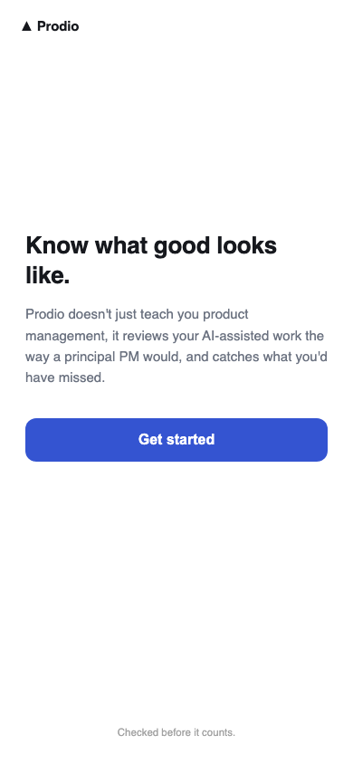</td>
<td>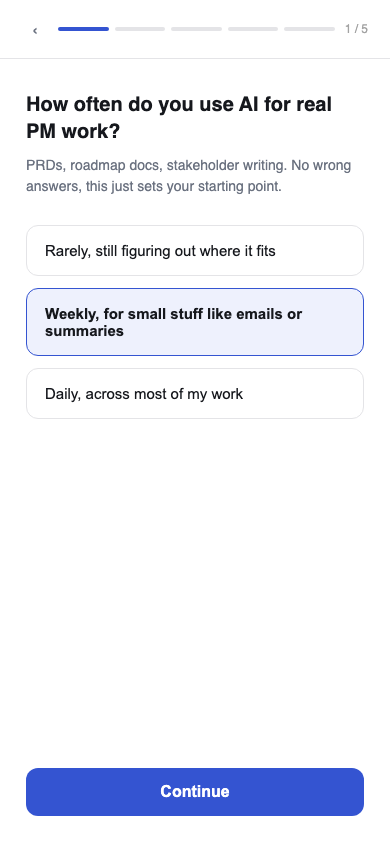</td>
<td>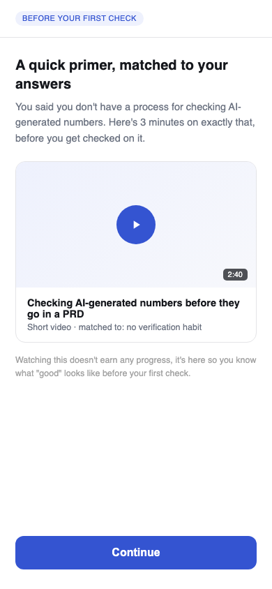</td>
<td>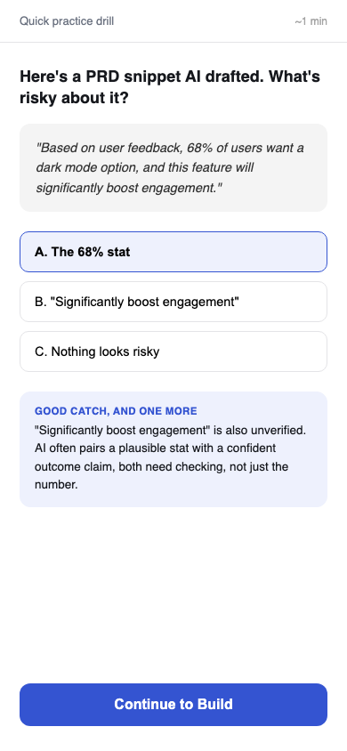</td>
</tr>
<tr>
<td align="center"><b>5. Build (real check)</b></td>
<td align="center"><b>6. Checking</b></td>
<td align="center"><b>7. Result + fix tip</b></td>
<td align="center"><b>8. Reasoning (adaptive)</b></td>
</tr>
<tr>
<td>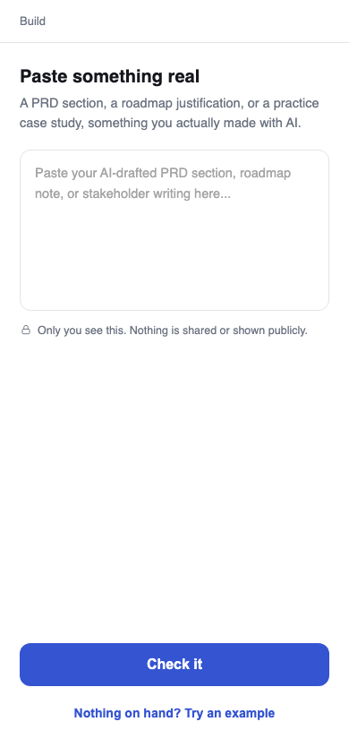</td>
<td></td>
<td>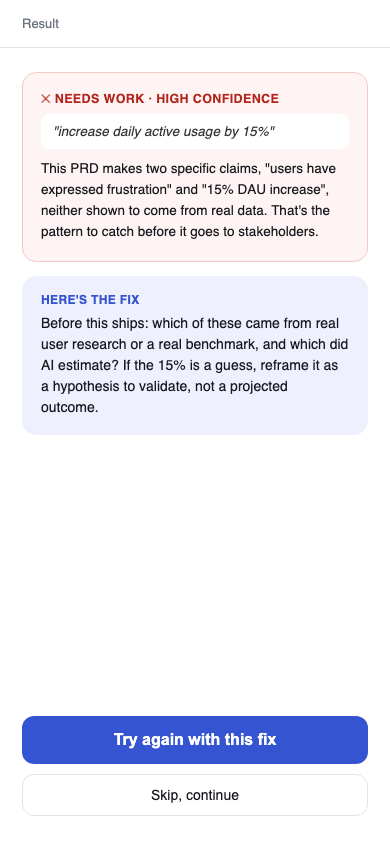</td>
<td>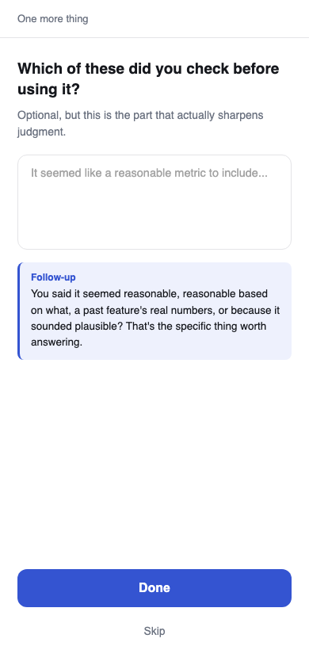</td>
</tr>
</table>

**Returning flow, Home is the hub**

<table>
<tr>
<td align="center"><b>Home</b></td>
<td align="center"><b>History</b></td>
<td align="center"><b>Ladder</b></td>
<td align="center"><b>Profile</b></td>
</tr>
<tr>
<td>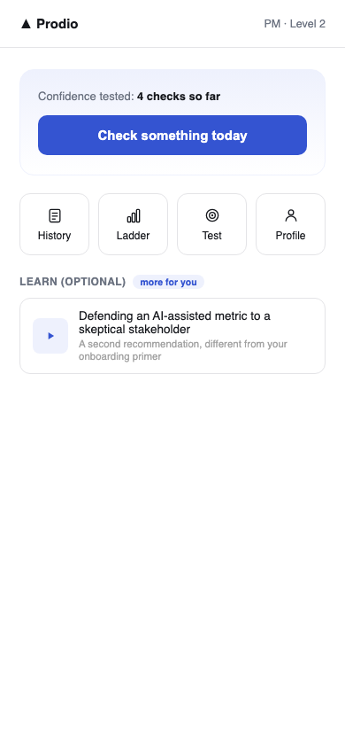</td>
<td>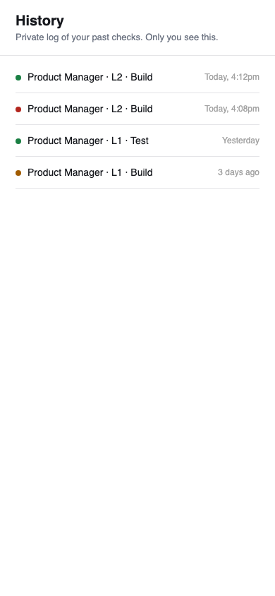</td>
<td>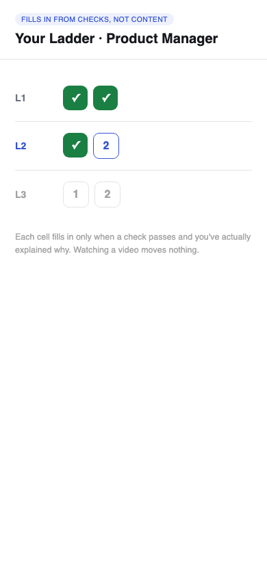</td>
<td>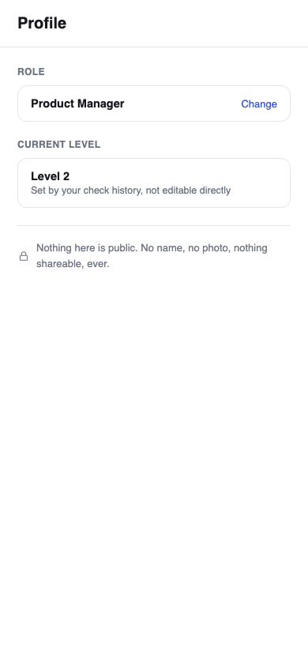</td>
</tr>
</table>

**Edge cases (mocked, not just described) and the Build desktop variant**

<table>
<tr>
<td align="center"><b>Low-confidence result</b></td>
<td align="center"><b>Dispute / flag, logged not overridden</b></td>
<td align="center"><b>Unsupported role</b></td>
</tr>
<tr>
<td>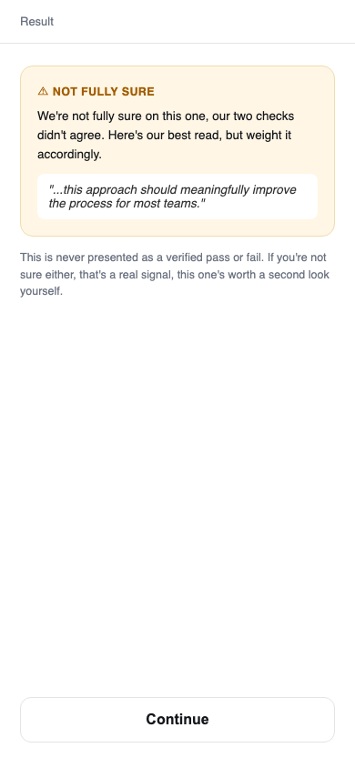</td>
<td>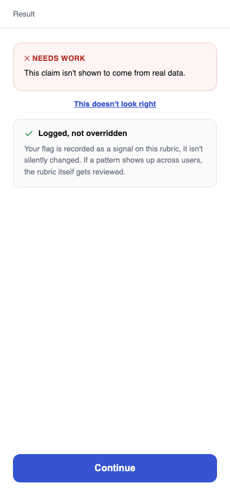</td>
<td>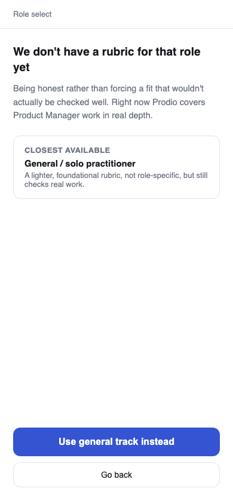</td>
</tr>
</table>

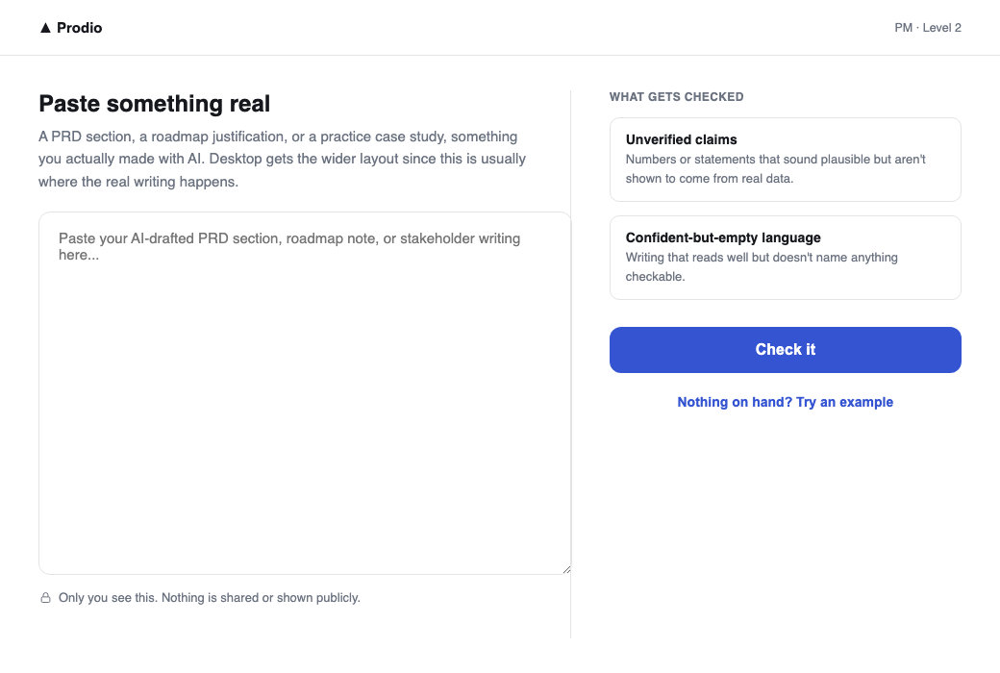

*Build, desktop-width variant, the real task (pasting written PRD work) is as much a desktop activity as a phone one*

Six components of UX, self-check. Honestly unmeasured until the pilot runs, no fabricated numbers here.

| Component | How to judge it | Status |
| --- | --- | --- |
| Usability | % who complete the core task with no help | Not yet measured, first read comes from the 40-50 pilot users |
| Efficiency | % who finish within the target time (under 3 min for a check) | Not yet measured |
| Perceived effort | How cluttered / heavy it feels | Design intent: one primary action per screen, no forced multi-step content before a check |
| Credibility | Social proof, trust cues, no broken states | Confidence badge and explicit uncertainty state are the trust mechanism; no social proof by design, this product doesn't claim popularity, it claims rigor |
| Delight | One moment of unexpected value | Candidate: the Ladder cell filling in immediately after a demonstrated-reasoning pass |
| Simplicity | Clicks to reach the outcome | Home to Result: 3 taps (Build, paste, Check it) for a returning user |

Inference: The mockups and interaction model are locked at wireframe-to-hi-fi fidelity. Section 12 defines exactly what gets measured once this is live, so the self-check table above stops being intent and starts being evidence.

## 12. Analytics & Event Tracking

| Layer | What it answers | This product |
| --- | --- | --- |
| North Star | Are we delivering the core value? | Checks completed per active user per week, with reasoning demonstrated, not just a passing verdict |
| Leading | Will the outcome improve soon? | % of onboarding completions reaching a first Build check; % of failed checks that trigger "try again" |
| Lagging | Did the outcome actually improve? | D7 return rate to Build, unprompted; Ladder cells filled per active user per week |
| Activation | Did the user hit the aha moment? | First check with demonstrated reasoning (not just a first check, per Section 12's own north star discipline: a pass alone isn't the milestone) |

Event tracking sheet

| Event name | Properties | Fires when |
| --- | --- | --- |
| level_check_completed | {starting_level, gap_pattern} | User finishes the 3-5 question placement |
| learn_viewed | {resource_id, gap_pattern, required:true} | Onboarding primer opened |
| drill_completed | {correct:bool, role, level} | Test drill answered |
| check_submitted | {role, level, source:real\|example, is_retry:bool} | Build check submitted |
| check_result | {verdict, confidence, call1_verdict, call2_agree:bool} | Grading pipeline returns a result |
| reasoning_submitted | {accepted_on_first_pass:bool, followup_triggered:bool} | User answers the reasoning prompt, and any follow-up |
| ladder_cell_filled | {role, level} | A check passes AND reasoning is demonstrated |
| result_disputed | {check_id} | User flags a result as wrong |
| signup_completed | {email} | User submits their email on Landing |

So what: few event names, rich properties, a deliberate instrumentation discipline. Every property maps to a decision already made in Sections 9-11, not a vanity count.

## 13. Build & Deployment

Solution: https://prodio-ten.vercel.app/

Stack (as built): Next.js on Vercel, Supabase (Postgres) for persistence, Groq (model openai/gpt-oss-120b, strict JSON-schema structured outputs) for the grading pipeline (Call 1 grades against the role+level rubric, Call 2 independently reviews Call 1 rather than rubber-stamping it, agreement sets the confidence badge). The model choice changed several times after this PRD's prior draft locked Gemini 3.7 Flash: 3.7 Flash's free tier produced frequent transient failures under real load, its next candidate turned out to be deprecated for new API keys, the model chosen after that, Gemini 3.6 Flash, capped at 20 requests per day per project, and its replacement, Gemini 3.5 Flash-Lite, worked but left the free-tier ceiling still uncomfortably low for a pilot. Gemini was replaced entirely with Groq, whose free tier (1,000 requests/day, 30 requests/minute) is verified directly against Groq's own billing page, and whose strict JSON-schema structured outputs make the earlier Call 2 shape-conflict bug (see Prodio Build Log.md) structurally impossible rather than merely worked around.

What's actually built, stated honestly: the real Next.js application (all 20 tasks in the implementation plan), the full two-call Groq grading pipeline, the level-placement questionnaire, the required-once Learn gate (now with a Skip option, since a required video with no way past it was a real drop-off risk), the adaptive reasoning follow-up, and the Ladder, verified end-to-end against real Groq calls and a real Supabase database, not mocked. A back button now sits in the shared top bar across every authenticated screen. The marketing landing page was rebuilt from a single centered card into a full page (DESIGN.md, an original design system authored for this rebuild): a real gradient-mesh hero built as layered CSS radial-gradients, the product's own two-call verification mechanism dramatized as the page's structure (a live example card showing the two calls disagree and resolve to "uncertain", not a generic screenshot), section-jump navigation, and an original illustration set. The authenticated app's shared shell was also fixed to render as a centered, properly proportioned card on desktop instead of a phone-width column stretched full-height across a wide screen, the shell/topbar/content structure and every screen's content are unchanged, only the desktop sizing. The code is on GitHub (private) and an initial Vercel deployment exists. What's not yet resolved: the production Vercel deployment is measurably slower than local for the same request (one real check took roughly 3 minutes on Vercel against 2 seconds locally for an identical call), under active investigation via Vercel's runtime logs before the pilot can run confidently live. Two of the four Learn video slots are still placeholder IDs pending real content.

Real risks found during the build, named rather than hidden: a prompt conflict where the second grading call could silently return the first call's response shape instead of its own, found via live testing and fixed by giving each call its own system instruction; a device-identity race condition where multiple components independently fetching the user's identity could mint duplicate device records on a first visit, undermining the very user-count the login feature exists to produce; the model's own stated explanation for a verdict was computed by the grading pipeline but never returned or shown to the user, a real judgment-transparency gap given the product's whole premise, found only because a user tested it and asked why the result didn't explain itself; and, during the landing page rebuild, an independent design review caught the hero's example verdict card showing the two grading calls agreeing, when the entire point of the page is that they can honestly disagree, the card was rewritten to actually demonstrate a disagreement resolving to "uncertain" before shipping. All are fixed and covered by tests or verified live.

Inference: Sections 1 through 13 now form a complete, evidence-traced document from problem to mockups to a named build plan. What remains is execution, not further design.

## 14. Launch, Growth Loop & Iteration

Launch, honestly stated: this is a pilot launch, not a public one. The application is built, deployed, and verified end-to-end (Section 13), but has not yet run against real users outside the build-and-test loop. “Launch” here means opening the existing Vercel deployment to the 40-50 person pilot group already sized in Section 13, not a marketing push or a public release.

| Phase | Gate to enter | What it proves |
| --- | --- | --- |
| Internal soak (done) | N/A | The pipeline holds under real Groq calls and a real Supabase database, not mocked (Section 13) |
| Small pilot | Production latency issue (Section 13) root-caused and resolved, GROQ_API_KEY correctly set in Vercel | The product survives real, unscheduled use, not just scripted verification |
| Full 40-50 user pilot | Small pilot shows no repeat failures on the check pipeline | The instrumentation in Section 12 produces a first real read on Activation, Leading, and Lagging metrics, currently honestly unmeasured |
| Any wider release | The pilot's own north star (checks completed per active user per week, with reasoning demonstrated) shows a real, repeatable pattern, not a one-time novelty spike | Decision to widen scope, not before |

No paid acquisition, ads, or public marketing surface is in scope for this pilot; recruiting the 40-50 users is a direct-outreach exercise (the persona's own network, Section 8), not a growth channel to design for yet.

Growth loop, constrained by what's already locked: Section 9 rules out leaderboards, public scores, and gamification mechanics as non-goals, so the obvious default growth loop for a “check your work” product, share your score, compare with peers, invite friends to compete, is not available here without reversing a decision already made for good reason (the Hypotheses doc's own H4 test explicitly flags “share progress with your team” as an unconfirmed, competing hypothesis against “private, judgment-free practice,” never resolved in the product's favor). The growth loop this product can actually use has to be earned from utility, not exposure.

Proposed (not built, directional): the stakeholder table (Section 8/persona mapping) already names colleagues and peers as “a likely referral channel later.” The mechanism consistent with private-by-default: when a check produces a specific, concrete fix tip, offer a one-tap “share this tip” action that sends the tip's text (not the user's score, not their submission, not their level) to a colleague. It refers by demonstrating usefulness once, not by displaying status. This is a hypothesis to test in the pilot, not a committed feature, and should not be built before Section 12's own event data shows people are reaching the fix-tip moment often enough for a share action to matter.

Iteration plan: the pilot's job is to generate the first real numbers behind Section 12's honestly-unmeasured metrics, then let those numbers, not opinion, decide what changes next.

| Signal (from Section 12's existing events) | If it's bad | What that triggers |
| --- | --- | --- |
| % onboarding completions reaching a first Build check (Leading) | Low | Investigate the Learn step specifically, a learn_skipped event exists in the shipped code (added after this PRD's last revision, not yet added to Section 12's event table) but isn't measured yet; a high skip rate paired with low activation would suggest the primer isn't the blocker people assume it is |
| First check with demonstrated reasoning (Activation) | Low relative to first check submitted | The reasoning follow-up (Section 6/7) may be too easy to abandon; revisit whether skipping it should be as frictionless as skipping the Learn video |
| D7 return rate to Build, unprompted (Lagging) | Low | The core premise (people return because it's useful, not because of any hook) hasn't held; this is the one number that would most directly challenge the product's own thesis, worth treating as a kill-or-continue signal, not a tuning knob |
| Pass rate per level/rubric | Skewed heavily to pass or fail | Rubric calibration issue, not a user behavior issue; fix the rubric text (lib/rubrics.ts), not the product |

Explicit non-goals for this section, consistent with Section 10: no cohort or team-based accountability mechanics (the Research Brief notes cohort/mandated completion rates of 70-85% vs. 4-15% for free, unmandated use, real evidence that accountability mechanisms work, but adding one here would mean building toward a group/social product this PRD has deliberately not chosen); no paid growth channel modeling; no feature work justified by a growth-loop idea alone without pilot data behind it first.

Inference: launch is a data-collection instrument before it's anything else. The pilot's only real job is to convert Section 12's “honestly unmeasured” metrics into real numbers, and every idea in this section, the referral mechanic included, stays a hypothesis, not a commitment, until those numbers say otherwise.

## Appendix A: Ship-Ready Pressure-Test

Every pressure-test question below, answered against what this document and the shipped product actually contain, not restated as intent.

Section 1, The Given Problem

Q: Can you state, in one sentence, what the FIRST version solves, without listing features? A: The first version checks whether a professional's real, AI-assisted work actually holds up against a role-specific standard, before someone else checks it for them.

Q: Have you separated the market opportunity (big) from the specific bottleneck you will fix (narrow)? A: Yes. Section 4 sizes the market ($22.2B generative-AI market in 2025; a $5.5T estimated skills-gap cost). Sections 1 and 7 narrow that to one bottleneck: nothing checks a professional's real output against a role standard.

Q: Do you name what you will deliberately NOT build? A: Yes, stated explicitly in Section 1 and repeated with more detail in Sections 8 and 10: full software-engineering depth, deep AI theory, a generic one-size-fits-all curriculum, and an enterprise sales-led rollout for v1.

Section 2, Stakeholder Mapping

Q: Who is the primary user, the buyer, and the influencer, named separately? A: User and buyer are the same person for v1, a self-serve, bottom-up motion. The employer is named explicitly as an influencer only, not a decision-maker; an employer-funded v2 buyer model is named as a future direction, not assumed for the MVP.

Q: Is the real stall point backed by evidence, not a guess? A: Yes. Section 3 names the stall point (nothing tells the learner if they are on the right track), and Sections 4 to 6 independently converge on it: the SWAYAM completion data, the 32%-clear-standard statistic, and the primary-research field account all point at the same seam.

Q: Have you avoided listing stakeholders with no real evidence behind them? A: Yes. The persona set stays deliberately narrow, one primary persona plus one secondary persona explicitly labeled thin evidence, one interview only, rather than a padded stakeholder list.

Section 3, The Learning Journey

Q: Can you point to the one stage that causes the most failure? A: Yes, named directly in Section 3's own Inference line and confirmed independently across Sections 4 to 6.

Q: Are your findings symptoms or root causes? A: Distinguished explicitly in Section 7's re-scoring: struggling to start (a symptom-adjacent friction, addressed by navigation) is separated from capability not following once someone does start (the root cause, the judgment gap), and the PRD demotes the symptom-level fix accordingly.

Q: Did you map what people actually do, not an idealized process? A: Yes, primary research (Section 6) is anchored on real behavior via an explicit SAW / THINK / ASSUME split, not an assumed workflow.

Section 4, Secondary Research

Q: For every statistic, does it say what you claim? A: Every cited number carries a named source (Grand View Research, IDC, SWAYAM and the Parliamentary committee finding) and its own “so what” sentence.

Q: Does secondary research explain WHY, not just restate that the problem exists? A: Yes. The SWAYAM finding is the clearest case: a free, credible, IIT-produced, nationally available course still completed at under 4%, which explains why content-first fixes fail, not just that adoption is low.

Q: Is this section earning its pages? A: Kept to four grouped findings, each retained specifically because it changes the MVP direction, the SWAYAM finding most directly, since it overturns an earlier draft's conclusion in Section 7.

Section 5, Existing Tools

Q: If so many tools exist, why does the problem persist? A: Because none of them are built to do this specific job. Course platforms and cohorts teach, Duolingo-style apps gamify generic literacy, ChatGPT answers what is asked, but nobody checks a professional's real, job-specific output against a real standard for their role.

Q: Which job is every current tool failing to finish? A: Verifying real work product, not delivering more content or generic literacy practice.

Section 6, Primary Research

Q: Is the research aimed at locating the bottleneck, not re-proving the problem? A: Yes, structured around SAW / THINK / ASSUME and aimed at confirming who feels the gap sharpest and what specifically breaks, not re-litigating whether the problem exists.

Q: Does your confidence match your sample size? A: The PRD states plainly that the live survey sample skews toward already-confident respondents, labeled ASSUME, not presented as a settled fact.

Section 7, Opportunity and Prioritisation

Q: Can you fill BECAUSE with evidence, not a guess dressed as a reason? A: Yes, and the section models this directly: it shows an earlier draft's own reasoning (H1 and H4 tied) and then corrects it against the strongest evidence in the research, the SWAYAM finding, rather than defending the original conclusion.

Q: Did you prioritise on value versus effort, and did solution risk factor in? A: Re-scored on Importance times (1 minus Satisfaction), then weighed against an explicit solution-risk asymmetry: a navigation-first fix already has a documented failure at scale (SWAYAM); judgment-checking does not.

Q: Who exactly is it FOR? A: Named precisely: the employed, mid-career non-technical professional who already uses AI daily, not “professionals” in general.

Section 8, Product Strategy

Q: Have you named the user and the buyer separately? A: Yes, both are the same person for v1 by design (self-serve), with the employer-as-v2-buyer path explicitly deferred rather than conflated with v1.

Q: Does your confidence match the size of your evidence? A: Yes. Persona 2 (the Solo Practitioner) is explicitly flagged “thin evidence, one interview only” rather than presented with the same confidence as the primary persona.

Q: Is the scope locked and written down? A: Yes, an explicit “Locked scope, as of this section” in/out list, referencing what Sections 7 and 9 already ruled out.

Section 9, Solution Ideation and Direction

Q: Did you genuinely diverge, or dress one idea in three costumes? A: Three genuinely different directions were evaluated against the locked opportunity; the rejected content-first direction is named and its rejection reasoning kept visible rather than deleted.

Q: Can you say why the rejected directions lost, in one sentence each? A: The content/curriculum-first direction loses specifically on the SWAYAM evidence: a well-sequenced, credible path already failed at 96% under ideal conditions.

Q: Does the flow reach the outcome the persona actually wants? A: Yes, per the section's own Inference line: the flow traces every step back to the persona and problem statement locked in Section 8.

Section 10, Product Detailing and MVP Scope

Q: Does every feature trace to a real user need? A: Yes. Concretely, the rubric detail (“The rubric, concretely”) spells out exactly what Call 1 checks for at each level, tied directly to the persona's actual failure mode: unsourced claims and confident, empty language.

Q: Is V1 truly the thinnest slice that delivers the core outcome? A: An explicit non-goals list rules out a general-purpose review engine, gamification beyond a private progress indicator, a pre-built content curriculum, and any B2B surface, each named as a stated non-goal, not an oversight.

Q: For your top edge cases, can you state exactly what the product does? A: Yes, four are written as “When X, the product does Y”: cold start, a low-confidence result, a disputed result, and an unsupported role.

Section 11, UX and Product Design

Q: Did you work conceptual, then information, then interaction, then visual, in that order? A: Yes, stated explicitly in that order in the section's own opening paragraph.

Q: Can you point to a screen and say what the named persona sees, thinks, and does? A: Yes. Home is framed around Dev's own mental model: “confidence tested,” not logins, with “check something today” as the one primary action.

Q: For the six UX components, do you have evidence or an opinion? A: Neither claimed falsely: the section states plainly that the self-check is “honestly unmeasured until the pilot runs, no fabricated numbers,” declining to invent confidence it does not have yet.

Section 12, Analytics and Event Tracking

Q: Is your North Star a single value metric, not a dashboard pretending to be one? A: Yes, one North Star (checks completed per active user per week, with reasoning demonstrated), with Leading, Lagging, and Activation kept clearly separate underneath it.

Q: Does every metric pass the So What test? A: Yes, stated as the section's own instrumentation rule: few event names, rich properties, every property maps to a decision already made in Sections 9 to 11, not a vanity count.

Q: Can you point to where each event fires and where the data lands? A: Yes, verified live via a working admin analytics view reading the real Supabase events table, not just planned. One honest caveat found while building that view: most historical volume there was this build's own QA testing, not real pilot users, now explicitly excluded from the reported numbers behind a launch-date cutoff, rather than presented as real usage.

Section 13, Build and Deployment

Q: Is there a working link a mentor can click right now? A: Yes: https://prodio-ten.vercel.app/, connected to GitHub for auto-deploy on every push to main.

Q: Can you say precisely what is real, what is stubbed, and what is cut? A: Yes. All 20 implementation-plan tasks are built and verified end-to-end against real Groq calls and a real Supabase database, not mocked. Two of four Learn video slots are still placeholder IDs. The production latency gap (roughly 3 minutes on Vercel versus 2 seconds locally for an identical request) is named as a real, unresolved issue, not hidden.

Q: Does the core flow survive a stranger using it unaided, and do you know what breaks first? A: Not yet independently verified by a genuine stranger, stated honestly rather than assumed. Real bugs were found and fixed during my own testing (a device-identity race condition that silently bounced new signups back to the landing page, a discarded grading explanation, a Call 2 schema conflict), evidence the flow was stress-tested, but a true unaided-stranger test has not run yet; that is exactly the job Section 14 assigns to the pilot.

Section 14 sits outside the original 13-section template, added once the build surfaced a real question the template does not ask: what happens after Sections 1 through 13 are done and the product is live. Its own Inference line is its pressure test: every idea in it, including the referral mechanic, stays a hypothesis until the pilot's real numbers say otherwise, not a committed feature dressed up as one.

## Appendix B: How This PRD Came Together

Honestly stated, there was no single prompt. This PRD, and the working product behind it, came out of an extended, iterative collaboration between me and Claude Code across a multi-day build, not a one-shot generation from a tidy instruction. The shape of that process, for anyone reusing this approach with an AI collaborator:

Research and framing came first, and stayed human-owned: the problem framing, the persona, the primary and secondary research, and the opportunity scoring in Sections 1 through 8 were written and revised by me, with Claude used for synthesis, structuring, and pressure-testing reasoning already decided, not for inventing the findings themselves. Where an earlier draft's conclusion did not hold against the evidence (Section 7's H1/H4 correction), that correction was made explicitly rather than smoothed over.

The build was done task by task against a written implementation plan, test-driven where the logic allowed it (grading, level placement, gap detection, ladder computation all carry real unit tests), with every model, library, and infrastructure choice verified against real, current information rather than assumed, the LLM provider alone went through several real, documented changes (Gemini 3.7 Flash, then 3.6 Flash, then 3.5 Flash-Lite, then Groq) as each one's actual free-tier limits were hit and confirmed, not guessed at in advance.

Design followed the same discipline as the research: a proprietary reference file was flagged and rejected once it was recognized as too close a copy of another real company's brand identity, and an original design system was authored instead, then extended into the product with an independent design review that caught real defects (a hero example contradicting the product's own thesis, a banned UI pattern, a contrast failure) before shipping, not after.

Every claim in this PRD that could be checked was checked: the admin analytics page reads the actual production database rather than reporting a remembered number, and when that first check revealed the reported numbers included this session's own test traffic, the fix was to correct the analytics, not to soften the claim. The standing rule across the whole build: an estimate is labeled an estimate, and a number that turns out to be wrong gets corrected in the document, not defended.
